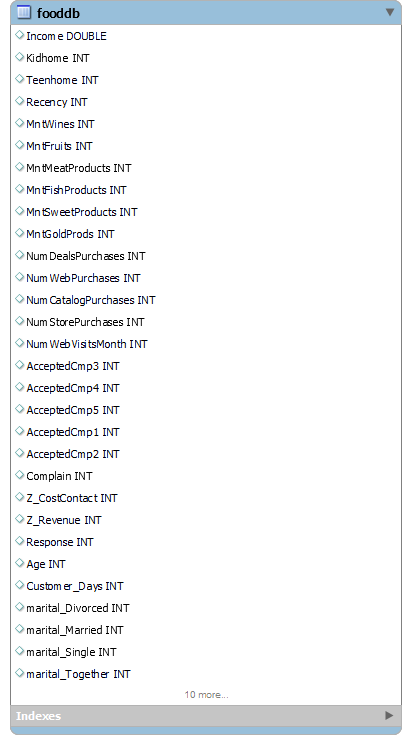

#  Customer Analytics SQL Project  

## 📌 Project Overview  
This project analyzes **customer behavior, churn prediction, marketing effectiveness, and sales performance** using SQL.  
The goal is to **help businesses improve customer retention, optimize marketing campaigns, and increase revenue** by understanding customer purchase behavior.  

**🛠️ Skills Used:** SQL (CTEs, Joins, Window Functions, Aggregations)  
**📂 Dataset:** Customer purchase dataset from Kaggle  

---

# **📊 Business Insights & Analysis**  

## ** Customer Segmentation & Profiling**  
### **Goal:**  
Categorize customers based on **spending behavior & recency** to personalize marketing strategies.  

### **Key Insights:**  
**VIP Customers (High Spending, Recent Buyers)** should be targeted with loyalty programs.  
**At-Risk Customers (Haven't bought in 90+ days)** need **re-engagement campaigns**.  
**Low Spenders churn the most**, meaning they might need discounts to stay engaged.  

### ** Business Recommendation:**  
 **Offer personalized discounts to At-Risk Customers** to improve retention.  

---

## ** Customer Churn & Retention Analysis**  
### **Goal:**  
Identify churned customers & develop retention strategies.  

### **Key Insights:**  
**Low-income customers have the highest churn rate (9.19%)**, while higher-income customers churn slightly less (8.89%).  
**Lower spenders churn more, while high-value customers are more loyal**.  
**Medium & high spenders rarely churn**, meaning they have stronger engagement.  

### ** Business Recommendation:**  
**Increase engagement for low-income & low-spending customers** with **personalized promotions**.  

---

## ** Marketing Campaign Effectiveness**  
### **Goal:**  
Analyze which marketing campaigns performed best.  

### **Key Insights:**  
**Campaign 3 had the highest acceptance rate**, meaning customers engaged the most.  
**Low Spenders engaged the most with marketing**, showing they respond well to promotions.  
**VIP Customers didn’t engage as much**, meaning they don’t rely on discounts to buy.  

### ** Business Recommendation:**  
 **Optimize future marketing efforts based on Campaign 3’s strategy**.  
 **Use different marketing strategies for VIPs vs. Low Spenders**.  

---

## ** Sales Performance by Purchase Channels**  
### **Goal:**  
Identify whether customers prefer **web, store, or catalog purchases**.  

### **Key Insights:**   **Store purchases generate the most revenue per order**, meaning in-store experiences matter.  
**Web purchases are frequent but have lower revenue per order**, meaning online promotions should focus on volume.  
**Catalog purchases are less frequent but have high revenue per order**, meaning businesses should continue catalog marketing.  

### ** Business Recommendation:**  
 **Invest in in-store experiences & online promotions** based on shopping behavior.  

---

## ** RFM Analysis (Recency, Frequency, Monetary)**  
### **Goal:**  
Identify the most valuable customers.  

### **Key Insights:**  
**High RFM customers should be prioritized for premium services & exclusive offers**.  
**Low RFM customers need engagement strategies to become loyal buyers**.  

### ** Business Recommendation:**  
**Create a VIP loyalty program for high RFM customers**.  

---

## ** Cross-Sell & Product Affinity Analysis**  
### **Goal:**  
Identify which products are frequently bought together to boost cross-sell opportunities.  

### **Key Insights:**  
 **Wine & Meat are the most commonly bought together** → Opportunity for **bundle deals**.  
 **Gold & Wine Buyers are a separate premium segment** → Target them with luxury promotions.  

### ** Business Recommendation:**  
 **Launch bundled deals (Wine + Meat, Gold + Wine) to increase sales**.  

---

## ** High-Value Customer Prediction**  
### **Goal:**  
Predict future VIP customers based on spending & frequency.  

### **Key Insights:**  
**Potential VIP customers exist & should be nurtured** before they churn.  
**They shop frequently but haven’t reached VIP spending yet**.  

### ** Business Recommendation:**  
 **Offer personalized incentives to transition potential VIPs into high-value customers**.  

---

## ** Customer Lifetime Value (CLV) Estimation**  
### **Goal:**  
Predict long-term revenue from each customer.  

### **Key Insights:**  
 **Some customers contribute more long-term revenue than others**.  
 **Low CLV customers need engagement campaigns to improve retention**.  

### ** Business Recommendation:**  
 **Use CLV scores to allocate marketing budgets effectively**.  

---

# **📂 SQL Scripts Included**  
All SQL scripts for the analysis are available in this repository:  

📜 [`01_Customer_Segmentation.sql`](./01_Customer_Segmentation.sql)  
📜 [`02_Customer_Churn.sql`](./02_Customer_Churn.sql)  
📜 [`03_Marketing_Campaigns.sql`](./03_Marketing_Campaigns.sql)  
📜 [`04_Sales_Performance.sql`](./04_Sales_Performance.sql)  
📜 [`05_RFM_Analysis.sql`](./05_RFM_Analysis.sql)  
📜 [`06_Cross_Sell_Analysis.sql`](./06_Cross_Sell_Analysis.sql)  
📜 [`07_High_Value_Customer_Prediction.sql`](./07_High_Value_Customer_Prediction.sql)  
📜 [`08_CLV_Estimation.sql`](./08_CLV_Estimation.sql)  

Click on any script above to **view the full SQL queries in GitHub**.
---

## 📌 Database Schema (ER Diagram)  
This diagram represents the structure of the `fooddb` table used for customer analytics.  

---

# **🚀 About Me**  
👋 Hi, I'm **AJAYI OLUWASEYI**, a Data Analyst passionate about using SQL to solve business problems.  
📧 Contact: **Oluwaseyi1414@gmail.com**  
💼 LinkedIn: **www.linkedin.com/in/ajayi-oluwaseyi-865a35248**  

---

###  If you found this project helpful, **please star this repository**!   

